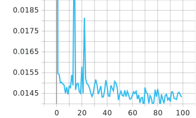
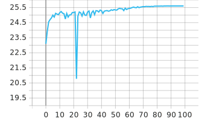

## Miniproject 1
### Implementation details
- **network** We implement the U-network (Ronneberger et al., 2015) in `others/unet.py`. For all basic noise and text removal
experiments with RGB images, the number of input and output channels were n = m = 3. For Monte Carlo denoising we had n = 9, m = 3. The network weights were initialized following Kaiming initialization. No batch normalization, dropout or other regularization techniques were used.
- **optimizer** Training was done using ADAM (Kingma & Ba, 2015) with parameter values beta1 = 0.9, beta2 = 0.99, eps = 10−8
- **learning rate** Learning rate was kept at a constant value during training except for the last rampdown period at where it was smoothly
brought to zero. Initiall learning rate of 0.001 was used for all experiments except Monte Carlo denoising, where 0.0003
was found to provide better stability. We implement the learning rate scheduler as `RampedLR` in `others/utils.py`. The initial learning rate is `params.lr`, and the percent of last ramped down epochs is `params.ramp_down_percent`.
- **loss**. We use L1, L2 loss (default L2) for all basic noises, and HDR loss (implemented as `HDRLoss` in `others/utils.py`) only for Monte Carlo denoising.
- **training step** We use `params.epoch` to specify number of total epochs, `params.batch_size` to specify the batch size, `params.iteration_per_epoch` to specify number of batches per epoch.
- **model evaluation** The evaluation is baed on the Peak Signal-to-Noise Ratio (PSNR) ratio, implemented in `psnr` in `others/utils.py`.
- **logging** If tensorboard is installed, we use it for logging. Otherwise, we do not log.
- **hyperparameters** We implement `Model()._parse()` to deal with hyperparameters for initialization.

### Experiments
We report the results in the following. 

We our best model can achieve >25dB in the validation set.